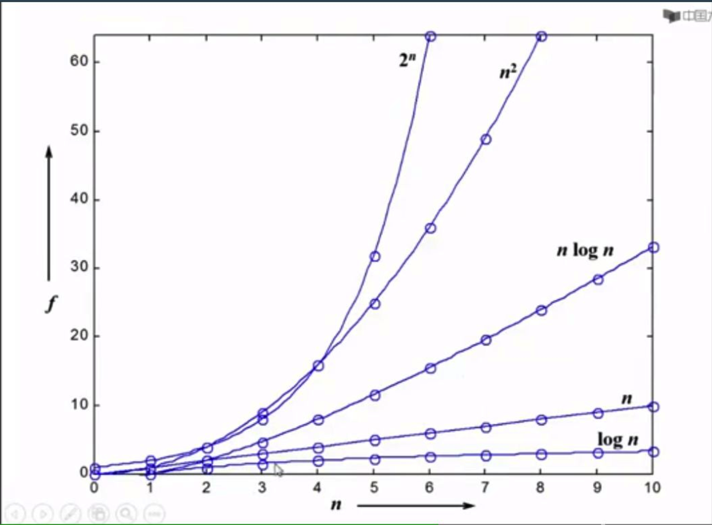

## 1什么是数据结构

数据对象在计算机中的组织方式，有逻辑结构和物理存储结构分类。

数据对象上的操作，完成这些操作的就是算法。

### 1.1抽象数据类型

描述数据结构的方法，抽象数据类型Abstract Data Type

抽象：描述数据类型的方法不依赖于具体的实现。

## 2算法
有限输入（可选）、必须输出、必须可以停止.

空间复杂度：程序在执行时占用存储单元的长度。

时间复杂度：程序在执行时耗费时间的长度。

最坏情况复杂度

平均复杂度

### 2.1算法复杂度渐进表示法

