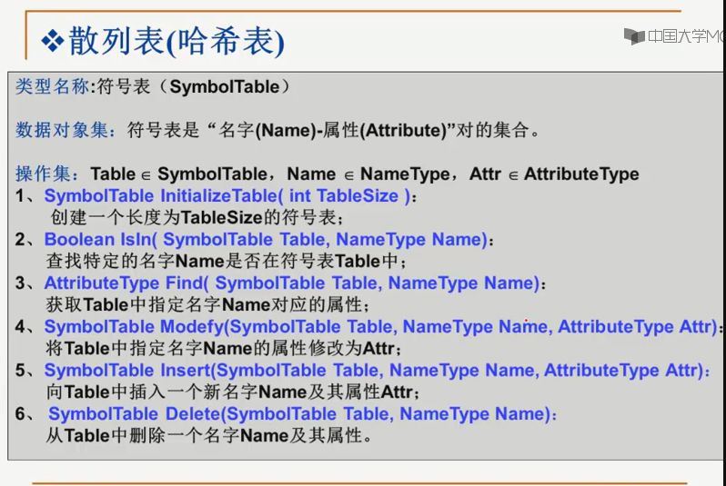

## 散列

直接算出查找对象的位置

散列查找法的2项基本工作：
1. 计算位置，构造散列函数确定关键词存储位置，位置是个整数值
2. 解决冲突，应用某种策略解决关键词位置相同的问题

时间复杂度几乎是O(1)

装填因子：摄散列表空间为M，填入表中元素个数是n,则a=n/m称为散列表的填装因子。

一个好的散列函数的特点：
1，计算简单，以便提高转换速度
2，关键词对应的地址空间均匀分布，以尽量减少冲突

数字关键词的散列函数构造：
1，直接定址法
2，除留余数法
3，数字分析法

字符关键词的散列函数构造：
1，ASCII码加和法
2，移位法

处理冲突常用的方法：
1，换个位置：开放地址法，具体有线性探测、平方探测、双散列
2，不换位置：链地址法

实用最大填装因子一般在0.5-0.85之间。

散列表的性能分析：
平均查找长度（ASL）：成功和不成功的

总之，填装因子小于0.5时效率最好。